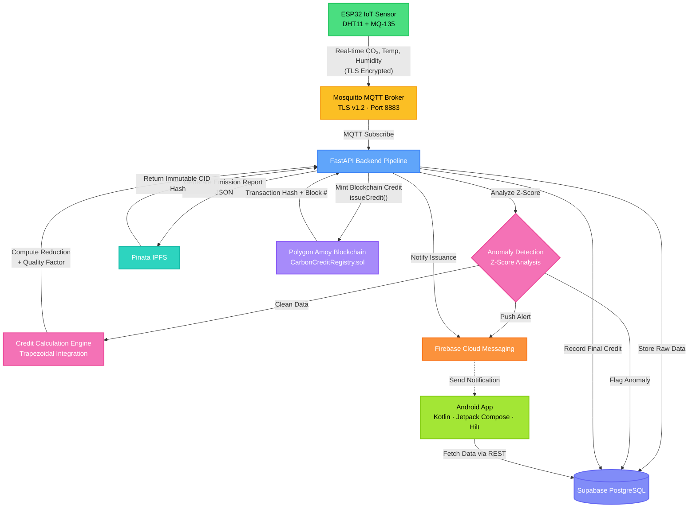
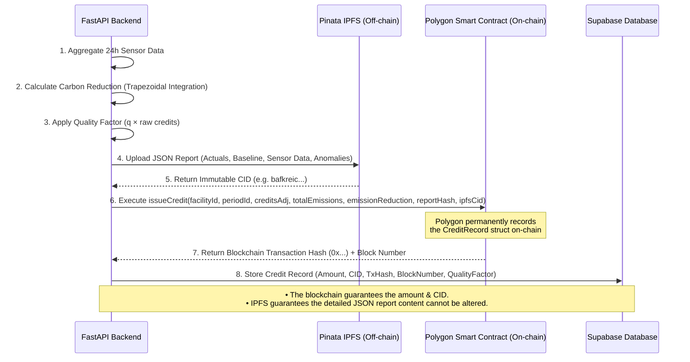

# 🌿 CarbonTrust: Blockchain-based Carbon Credit Verification


**CarbonTrust** is a full-stack, enterprise-grade blockchain platform designed to automate the verification, monitoring, and issuance of carbon credits. The system uses IoT sensors to collect CO₂ emission data, verifies it through statistical anomaly detection, calculates exact emission reductions against baselines, and issues verifiable carbon credits stored on the Polygon blockchain with immutable IPFS audit reports.

---

## ✨ Key Features

- **📡 Real-time IoT Monitoring:** CO₂, temperature, and humidity tracking from ESP32 sensors (DHT11 + MQ-135) via TLS-secured MQTT.
- **🔐 TLS-Secured Communication:** Mosquitto MQTT broker configured with TLS v1.2 and certificate-based encryption for all IoT traffic.
- **🛡️ Anomaly Detection:** Statistical Z-score analysis with configurable thresholds to flag tampered or faulty sensors.
- **🧮 Automated Credit Calculation:** Trapezoidal integration of emission reductions with quality-adjusted scoring for high-precision accounting.
- **⛓️ Blockchain Verification:** Immutable credit records minted securely on the Polygon Amoy testnet via the `CarbonCreditRegistry` smart contract.
- **📄 IPFS Audit Reports:** Tamper-proof JSON emission reports with content-addressed storage (Pinata).
- **🔗 Chain Visualizer:** Interactive blockchain explorer within the app — view the entire credit chain, tap any block to inspect its on-chain data, transaction hash, quality factor, and emission details.
- **📋 On-Chain Contract Record:** Dedicated smart contract detail card displaying all `CreditRecord` struct fields (`facilityId`, `periodId`, `creditsAdj`, `totalEmissions`, `emissionReduction`, `reportHash`, `ipfsCid`, `timestamp`, `blockNumber`) with copyable hashes.
- **📱 Role-Based Mobile App:** Native Android app built with Jetpack Compose featuring dedicated dashboards for Admins, Managers, and Auditors.
- **🏢 Admin & Oversight Tools:** Hierarchical admin dashboard for global oversight of all registered companies, facilities, and real-time auditor assignment management.
- **🔔 Push Notifications:** Firebase Cloud Messaging (FCM) alerts for anomalies and credit issuance.
- **🧪 Built-in Demo Simulator:** Run the entire pipeline dynamically without physical hardware!

---

## 🏗️ System Architecture & Methodology

The methodology follows a robust pipeline: Data Ingestion ➡️ Validation ➡️ Calculation ➡️ Tokenization. 



---

## ⛓️ Blockchain Data Storage Flow

To prevent bloating the blockchain with large amounts of sensor data while still maintaining complete transparency and immutability, CarbonTrust uses a hybrid on-chain/off-chain storage model.



---

## 📜 Smart Contract: CarbonCreditRegistry

The `CarbonCreditRegistry.sol` (Solidity ^0.8.24) deployed on Polygon Amoy stores each carbon credit as a `CreditRecord` struct:

| Field               | Type      | Description                                        |
| ------------------- | --------- | -------------------------------------------------- |
| `facilityId`        | `string`  | Facility UUID from Supabase                        |
| `periodId`          | `string`  | Human-readable period, e.g. `"2025-05"`            |
| `creditsAdj`        | `uint256` | Quality-adjusted credits × 1e6 (stored in grams)   |
| `totalEmissions`    | `uint256` | Total CO₂ emissions × 1e6 (grams)                  |
| `emissionReduction` | `uint256` | Emission reduction vs baseline × 1e6 (grams)       |
| `reportHash`        | `bytes32` | SHA-256 of the full emission report JSON           |
| `ipfsCid`           | `string`  | IPFS CID for fetching the full report              |
| `timestamp`         | `uint256` | `block.timestamp` at issuance                      |
| `issuedBy`          | `address` | Backend wallet address that called `issueCredit()` |

Each credit is assigned a deterministic on-chain ID: `keccak256(facilityId, periodId, reportHash)`.

---

## 📁 Project Structure

```
CarbonTrust-Blockchain/
├── android/                          # Native Android App
│   └── app/src/main/java/com/carboncredit/app/
│       ├── CarbonCreditApp.kt        # Application class (Hilt)
│       ├── core/                     # Utilities (DateUtils, Constants, etc.)
│       ├── data/
│       │   ├── models/               # Data classes (CarbonCredit, Facility, etc.)
│       │   └── repository/           # Supabase repositories
│       ├── di/                       # Hilt dependency injection modules
│       │   ├── AppModule.kt
│       │   ├── NetworkModule.kt
│       │   └── RepositoryModule.kt
│       ├── services/                 # Firebase messaging service
│       └── ui/
│           ├── admin/                # Admin role screens
│           │   ├── dashboard/        # Global oversight dashboard
│           │   └── auditors/         # Auditor assignment management
│           ├── auditor/              # Auditor role screens
│           │   ├── dashboard/        # Auditor dashboard + Chain Explorer banner
│           │   ├── comparison/       # Cross-facility comparison
│           │   ├── facility/         # Facility inspection
│           │   ├── reports/          # Audit report screens
│           │   ├── verification/     # Credit verification workflow
│           │   └── AuditorNavGraph.kt
│           ├── manager/              # Manager role screens
│           │   ├── dashboard/        # Manager dashboard + Chain Explorer banner
│           │   ├── credits/          # Credit ledger, detail, and on-chain card
│           │   ├── analytics/        # Emission analytics charts
│           │   ├── anomalies/        # Anomaly event screens
│           │   ├── sensors/          # Sensor management
│           │   ├── notifications/    # Notification center
│           │   ├── profile/          # User profile
│           │   └── ManagerNavGraph.kt
│           ├── shared/
│           │   └── chain/            # Chain Visualizer (blockchain explorer)
│           ├── auth/                 # Login & registration
│           ├── splash/               # Splash screen
│           ├── components/           # Reusable UI components
│           └── theme/                # Material 3 theme & colors
│
├── backend/                          # Python FastAPI Server
│   ├── app/
│   │   ├── main.py                   # FastAPI app with lifespan (MQTT + Simulators)
│   │   ├── config.py                 # Pydantic settings from .env
│   │   ├── api/
│   │   │   ├── router.py             # Route aggregator (/api/v1)
│   │   │   └── routes/
│   │   │       ├── auth.py           # Authentication endpoints
│   │   │       ├── admin.py          # Admin management endpoints
│   │   │       ├── facilities.py     # Facility CRUD
│   │   │       ├── sensors.py        # Sensor registration & management
│   │   │       ├── readings.py       # Sensor reading queries
│   │   │       ├── credits.py        # Carbon credit endpoints
│   │   │       ├── anomalies.py      # Anomaly event queries
│   │   │       ├── assignments.py    # Auditor ↔ Facility assignments
│   │   │       ├── ipfs.py           # IPFS proxy endpoint
│   │   │       └── simulator.py      # Simulator control API
│   │   ├── core/
│   │   │   ├── mqtt_client.py        # MQTT subscriber (Mosquitto)
│   │   │   ├── supabase_client.py    # Supabase client singleton
│   │   │   └── simulator.py          # Virtual sensor simulator engine
│   │   ├── services/
│   │   │   ├── pipeline.py           # Master pipeline orchestrator
│   │   │   ├── device_auth.py        # Device authentication (bcrypt)
│   │   │   ├── anomaly_detection.py  # Z-score anomaly detection
│   │   │   ├── emission_calculator.py # Trapezoidal integration + quality factor
│   │   │   ├── credit_issuer.py      # IPFS upload + blockchain mint + DB write
│   │   │   ├── report_builder.py     # JSON emission report builder
│   │   │   └── notification_service.py # FCM push notifications
│   │   ├── models/                   # Pydantic schemas
│   │   └── utils/                    # Logging, date utilities
│   ├── requirements.txt
│   ├── .env.example
│   │
│   ├── hardhat/                      # Smart Contract Tooling
│   │   ├── contracts/
│   │   │   └── CarbonCreditRegistry.sol  # Solidity smart contract
│   │   ├── scripts/
│   │   │   └── deploy.js             # Deployment script
│   │   ├── test/                     # Contract tests
│   │   └── hardhat.config.js
│   │
│   └── mosquitto/                    # MQTT Broker Configuration
│       ├── mosquitto.conf            # TLS + auth config (port 8883)
│       └── certs/                    # TLS certificates (gitignored)
│
├── iot/                              # IoT Firmware
│   └── sketch_jun19a.ino            # ESP32 Arduino sketch (DHT11 + MQ-135)
│
├── SETUP_GUIDE.md                    # Full database schema & Supabase SQL
├── WINDOWS_RUN_GUIDE.md              # Windows-specific setup instructions
└── .gitignore
```

---

## 📱 Android App — Role-Based Features

### 👤 Admin
- Global dashboard with oversight of all registered companies and facilities
- Auditor ↔ facility assignment management

### 🏭 Manager
- Real-time dashboard with key emission metrics
- **Chain Explorer** — interactive blockchain visualizer showing the entire credit chain with animated gold-spine UI; tap any block to view full details
- Credit ledger with all issued credits
- Credit detail view with emission summary, IPFS report link, blockchain TX verification, **on-chain smart contract record** (all `CreditRecord` struct fields), and QR code
- Sensor management and live readings
- Anomaly event tracking
- Emission analytics charts
- Push notification center

### 🔍 Auditor
- Auditor dashboard with assigned facilities overview
- **Chain Explorer** — same blockchain visualizer as Manager
- Cross-facility comparison tools
- Facility inspection and verification workflows
- Audit report generation
- Credit detail view with full on-chain data (shared screen with Manager)

---

## 📡 IoT Hardware Layer

The `iot/sketch_jun19a.ino` firmware runs on an **ESP32** microcontroller with the following sensor stack:

| Component  | Purpose                            | Pin           |
| ---------- | ---------------------------------- | ------------- |
| **DHT11**  | Temperature & humidity measurement | GPIO 4        |
| **MQ-135** | CO₂ concentration (ppm) estimation | GPIO 34 (ADC) |

**Communication:** The ESP32 connects to the Mosquitto MQTT broker over **TLS (port 8883)** using `WiFiClientSecure`. Sensor readings are published every 10 seconds as JSON payloads to the topic `factory/{facility_id}/readings`.

**Payload Format:**
```json
{
  "device_id": "SIM_5544F5B2",
  "auth_key": "a109c714-63b0-42e3-88f0-325b7c5083bd",
  "co2_ppm": 850.5,
  "temperature": 34.2,
  "humidity": 60.1,
  "timestamp": "2025-06-19T14:32:00Z"
}
```

---

## 🚀 Comprehensive Setup Guide

This guide covers everything needed to run the full stack locally.

### Prerequisites
- **Python 3.11+**
- **Node.js 18+** (for Hardhat)
- **Android Studio** (Hedgehog or later)
- **Supabase Account** (Free tier)
- **Pinata Account** (Free tier for IPFS)
- **MetaMask Wallet** with Polygon Amoy Testnet MATIC
- **Mosquitto MQTT Broker** (for IoT/simulator communication)
- *(Optional)* **ESP32 + DHT11 + MQ-135** sensors for hardware deployment

### 1. Supabase (Database + Auth) Setup
1. Create a project at [supabase.com](https://supabase.com).
2. Go to **Authentication → Providers** and enable the **Email** provider.
3. Open the **SQL Editor** in Supabase and run the full schema located in `SETUP_GUIDE.md` (which creates `user_profiles`, `facilities`, `sensors`, `sensor_readings`, `carbon_credits`, etc., and sets up Row-Level Security).
4. Go to **Project Settings → API** and copy your `SUPABASE_URL`, `SUPABASE_ANON_KEY`, and `SUPABASE_SERVICE_ROLE_KEY`.

### 2. IPFS (Pinata) Setup
1. Sign up at [pinata.cloud](https://pinata.cloud).
2. Go to **API Keys** → **New Key** (enable `pinFileToIPFS` and `pinJSONToIPFS`).
3. Copy your `PINATA_API_KEY` and `PINATA_SECRET_API_KEY`.

### 3. Blockchain (Polygon Amoy) Setup
1. Add Polygon Amoy to MetaMask (`RPC: https://rpc-amoy.polygon.technology/`, `Chain ID: 80002`).
2. Get free test MATIC from [amoyfaucet.com](https://amoyfaucet.com).
3. Copy your wallet's **Private Key**.
4. Deploy the smart contract:
   ```bash
   cd backend/hardhat
   npm install
   npx hardhat compile
   # Set your DEPLOYER_PRIVATE_KEY in your env before running
   npx hardhat run scripts/deploy.js --network amoy
   ```
5. Copy the deployed `CONTRACT_ADDRESS`.

### 4. Mosquitto MQTT Broker Setup
1. Install Mosquitto from [mosquitto.org](https://mosquitto.org/download/).
2. Generate TLS certificates for secure communication:
   ```bash
   # Generate CA certificate
   openssl req -new -x509 -days 365 -key ca.key -out ca.crt
   # Generate server certificate signed by CA
   openssl req -new -key server.key -out server.csr
   openssl x509 -req -in server.csr -CA ca.crt -CAkey ca.key -CAcreateserial -out server.crt -days 365
   ```
3. Place certificates in `backend/mosquitto/certs/` (this directory is gitignored).
4. Create the password file:
   ```bash
   mosquitto_passwd -c backend/mosquitto/passwd backend_user
   ```
5. Start the broker:
   ```bash
   mosquitto -c backend/mosquitto/mosquitto.conf -v
   ```

### 5. Backend Environment Configuration
Clone the repo and configure the Python backend:

```bash
cd backend
python -m venv venv
source venv/bin/activate       # On Windows: venv\Scripts\activate
pip install -r requirements.txt
cp .env.example .env
```

Edit your `.env` with the following:
```env
APP_ENV=development
SUPABASE_URL=https://<your-project>.supabase.co
SUPABASE_ANON_KEY=<your-anon-key>
SUPABASE_SERVICE_ROLE_KEY=<your-service-role-key>

PINATA_API_KEY=<your-pinata-api-key>
PINATA_SECRET_API_KEY=<your-pinata-secret>
PINATA_GATEWAY=https://gateway.pinata.cloud

POLYGON_RPC_URL=https://rpc-amoy.polygon.technology/
POLYGON_CHAIN_ID=80002
CONTRACT_ADDRESS=<deployed-contract-address>
DEPLOYER_PRIVATE_KEY=<metamask-private-key>

# MQTT Broker Configuration
MQTT_BROKER_HOST=localhost
MQTT_BROKER_PORT=8883
MQTT_USERNAME=backend_user
MQTT_PASSWORD=<your-mqtt-password>

# Enable the simulator to run without real ESP32 hardware!
SIMULATOR_ENABLED=true
SIMULATOR_INTERVAL_SECONDS=10
```

Start the backend server:
```bash
uvicorn app.main:app --host 0.0.0.0 --port 8000 --reload
```

### 6. Android App Setup
1. Open the `android/` folder in Android Studio.
2. Open `android/app/build.gradle.kts` and update the `buildConfigField` strings with your Supabase URL and Anon Key.
3. Add your `google-services.json` from Firebase Console to `android/app/`.
4. Sync Gradle.
5. Run the app on an emulator or physical device.

### 7. IoT Hardware Setup *(Optional)*
1. Open `iot/sketch_jun19a.ino` in Arduino IDE.
2. Install required libraries: `WiFi`, `PubSubClient`, `ArduinoJson`, `DHT`.
3. Update the configuration constants (WiFi SSID, MQTT broker IP, device credentials).
4. Flash to your ESP32 board.
5. Wire sensors: DHT11 → GPIO 4, MQ-135 → GPIO 34.

---

## 🔄 Data Pipeline (Per Sensor Reading)

```
1. ESP32/Simulator publishes reading → Mosquitto MQTT (TLS)
2. Backend MQTT subscriber receives payload
3. Validate payload fields
4. Authenticate device (device_id + bcrypt auth_key)
5. Store raw reading in Supabase
6. Run anomaly detection (moving-average + Z-score)
   ├── If anomaly → flag reading, insert anomaly_event, notify via FCM, STOP
   └── If clean → continue
7. Check credit calculation window (configurable hours since last credit)
8. Calculate credits via trapezoidal integration
9. Apply quality factor (q × raw credits = adjusted credits)
10. Build emission report JSON → upload to IPFS (Pinata)
11. Call issueCredit() on Polygon smart contract
12. Store final credit record in Supabase
13. Send FCM notification (credit issued)
```

---

## 💻 Tech Stack

| Domain                    | Technology                                              |
| ------------------------- | ------------------------------------------------------- |
| **Backend API**           | FastAPI (Python 3.11+)                                  |
| **Database**              | Supabase (PostgreSQL + Row-Level Security)              |
| **Smart Contracts**       | Solidity ^0.8.24, Hardhat                               |
| **Blockchain**            | Polygon Amoy Testnet                                    |
| **Decentralized Storage** | Pinata (IPFS)                                           |
| **Mobile Application**    | Android (Kotlin, Jetpack Compose, Material 3, Hilt)     |
| **IoT Hardware**          | ESP32 + DHT11 + MQ-135                                  |
| **IoT Protocol**          | MQTT over TLS v1.2 (Mosquitto, port 8883)               |
| **Push Notifications**    | Firebase Cloud Messaging (FCM)                          |
| **QR Verification**       | ZXing (on-device QR generation for blockchain TX links) |

---

## 📑 Standards & Organizations Reference Report

*This section is derived from the analytical model documentation (`main.pdf`) and explains the formulas, methodologies, and international/Indian standards that underpin the CarbonTrust system.*

---

### Overview

This report explains:
- The main formulas and methodologies used in the CarbonTrust project (analytical model, codebase, case study).
- Which global and Indian organizations define or follow the standards behind these formulas.
- Official links for each organization.
- How current processes of these organizations are improved by the CarbonTrust design.

---

## 1️⃣ Global Standards Followed by the Analytical Model

The analytical model and codebase follow widely accepted standards and guidance from several international bodies:

| Standard / Body                                         | Scope                                                                     |
| ------------------------------------------------------- | ------------------------------------------------------------------------- |
| **IPCC** – 2006 Guidelines for National GHG Inventories | Stationary combustion and emissions calculation                           |
| **GHG Protocol (WRI/WBCSD)**                            | Corporate GHG accounting and reporting standards                          |
| **UNFCCC / CDM**                                        | Baseline-and-credit methodology and 1 tonne CO₂e per credit convention    |
| **ICVCM**                                               | Core Carbon Principles for high-integrity carbon credits and data quality |
| **NIST** – FIPS 180-4                                   | Secure Hash Standard for SHA-256                                          |
| **OASIS MQTT**                                          | MQTT protocol specification for secure IoT messaging                      |
| **OWASP**                                               | Password Storage guidance (bcrypt)                                        |
| **Ethereum / EVM community**                            | Smart contract and event-log patterns for on-chain credit recording       |
| **IPFS / Protocol Labs**                                | Content-addressed storage standard via CIDs                               |

---

### 1.1 Moving Average Smoothing

**Formula:**

$$C_{avg}(t) = \frac{1}{w} \sum_{i=0}^{w-1} C(t - i)$$

**Usage:** Implemented in `emission_calculator.py` and the analytical model to smooth raw CO₂ sensor readings before anomaly detection.

**Standard Reference:** General signal-processing and statistical convention used in environmental monitoring and QA (US EPA QA Handbook).
🔗 [EPA QA Handbook (2020)](https://www.epa.gov/sites/default/files/2020-10/documents/qa-handbook-2020.pdf)

---

### 1.2 Z-Score Anomaly Detection

**Formula:**

$$Z(t) = \frac{C_{avg}(t) - \text{mean}}{\text{stddev}}$$

**Usage:** Implemented in `anomaly_detection.py` and the analytical model to flag abnormal deviations from historical patterns.

**Standard Reference:** NIST Engineering Statistics Handbook describes Z-score based outlier detection.
🔗 [NIST Z-Score Detection](https://www.itl.nist.gov/div898/handbook/eda/section3/eda35h.htm)

---

### 1.3 Emission Rate Calculation

**Formula:**

$$R(t) = \left(C_{avg}(t) - C_{bg}\right) \cdot Q \cdot \alpha$$

**Usage:** Implemented in `emission_calculator.py` and the analytical model to convert excess concentration and flow into a CO₂ mass-flow rate.

**Standard Reference:** IPCC 2006 Guidelines for National GHG Inventories, Volume 2 Chapter 2 on Stationary Combustion describe concentration-based emission estimation.
🔗 [IPCC 2006 – Stationary Combustion](https://www.ipcc-nggip.iges.or.jp/public/2006gl/pdf/2_Volume2/V2_2_Ch2_Stationary_Combustion.pdf)

---

### 1.4 Total Emissions via Integration

**Formula:**

$$E_{total} = \sum_{t} R(t) \cdot \Delta t$$

**Usage:** Implemented as discrete integration in `emission_calculator.py` to aggregate instantaneous emission rates over time.

**Standard Reference:** GHG Protocol Corporate Standard describes continuous emissions monitoring and integrating emission rates over time to obtain total emissions.
🔗 [GHG Protocol Corporate Standard](https://ghgprotocol.org/sites/default/files/standards/ghg-protocol-revised.pdf)

---

### 1.5 Baseline and Emission Reduction

**Formula:**

$$E_{red} = \max\left(0,\; E_{baseline} - E_{total}\right)$$

**Usage:** Implemented in `credit_issuer.py` and the analytical model to compute verified emission reductions relative to a baseline.

**Standard Reference:** UNFCCC CDM baseline-and-credit methodologies and GHG Protocol baseline guidance.
🔗 [UNFCCC CDM Methodologies](https://cdm.unfccc.int/methodologies/index.html)

---

### 1.6 Carbon Credit Conversion

**Formula:**

$$\text{Credits} = \frac{E_{red}}{\beta}$$

where β is typically equal to **1 tonne CO₂e per credit**.

**Usage:** Implemented in `credit_issuer.py` and the analytical model.

**Standard Reference:** Under CDM, Verra VCS, and India's CCTS, one carbon credit usually represents one tonne CO₂-equivalent.
🔗 [UNFCCC CDM Methodologies](https://cdm.unfccc.int/methodologies/index.html)

---

### 1.7 Quality-Adjusted Credits

**Formula:**

$$\text{Credits}_{adj} = \text{Credits} \times q$$

**Usage:** Implemented in `credit_issuer.py` and the analytical model, using `q` as a data-quality factor based on anomaly rate and completeness.

**Standard Reference:** ICVCM Core Carbon Principles and Assessment Framework emphasize data quality, uncertainty management, and integrity, supporting quality-based adjustment of credit eligibility or quantity.
🔗 [ICVCM Core Carbon Principles](https://icvcm.org/core-carbon-principles/)

---

### 1.8 SHA-256 Report Hashing

**Formula:**

```
report_hash = SHA256(report_json)
```

**Usage:** Implemented in `HashUtils.kt`, `hash_utils.py`, and used in `CarbonCreditRegistry.sol` to anchor emission reports on-chain.

**Standard Reference:** SHA-256 is defined in NIST FIPS 180-4 Secure Hash Standard.
🔗 [NIST FIPS 180-4](https://csrc.nist.gov/pubs/fips/180-4/upd1/final)

---

### 1.9 Blockchain Credit Record Structure

**Component:** `CreditRecord` struct and `issueCredit` function in `CarbonCreditRegistry.sol`.

**Usage:** Immutable on-chain representation of each credit including facility ID, period ID, quality-adjusted credits, total emissions, emission reduction, report hash, IPFS CID, timestamp, etc.

**Standard Reference:** Ethereum/EVM smart contract paradigms and ERC-style event logging.
🔗 [Ethereum Smart Contracts Docs](https://ethereum.org/en/developers/docs/smart-contracts/)

---

### 1.10 IPFS Content-Addressed Storage

**Component:** IPFS CID representing each emission report JSON.

**Usage:** Implemented in `ipfs_client.py` and backend to ensure tamper-proof storage of reports.

**Standard Reference:** IPFS protocol specification for content addressing.
🔗 [IPFS Content Addressing](https://docs.ipfs.tech/concepts/content-addressing/)

---

### 1.11 Device Authentication with bcrypt

**Component:** Hashing of device authentication keys using bcrypt (`device_auth.py`).

**Standard Reference:** OWASP Password Storage Cheat Sheet recommends bcrypt for secure password and secret storage.
🔗 [OWASP Password Storage Cheat Sheet](https://cheatsheetseries.owasp.org/cheatsheets/Password_Storage_Cheat_Sheet.html)

---

### 1.12 MQTT over TLS

**Component:** TLS-secured MQTT communication configured in `mosquitto.conf` and used by `mqtt_client.py`.

**Standard Reference:** OASIS MQTT specification (v3.1.1 / v5.0) describes secure IoT messaging over TLS.
🔗 [OASIS MQTT v5.0 Specification](https://docs.oasis-open.org/mqtt/mqtt/v5.0/mqtt-v5.0.html)

---

## 2️⃣ Indian Organizations & Their References

### 2.1 Core Indian Organizations in the Case Study

| Organization                                                      | Role in India's Carbon Credit System                                                                               | Official Link                                                                                                                 |
| ----------------------------------------------------------------- | ------------------------------------------------------------------------------------------------------------------ | ----------------------------------------------------------------------------------------------------------------------------- |
| **Ministry of Power (MoP)**                                       | Overall policy owner of the Carbon Credit Trading Scheme (CCTS) and the Indian Carbon Market                       | [powermin.gov.in](https://powermin.gov.in/)                                                                                   |
| **Ministry of Environment, Forest and Climate Change (MoEFCC)**   | National climate strategy; formally designates covered entities under CCTS; ensures Paris Agreement alignment      | [moef.gov.in](https://moef.gov.in/)                                                                                           |
| **Bureau of Energy Efficiency (BEE)**                             | Administrator of CCTS; sets GEI targets, methodologies, MRV rules                                                  | [beeindia.gov.in](https://beeindia.gov.in/)                                                                                   |
| **Grid Controller of India Ltd (Grid-India)**                     | National registry that issues, holds, and cancels Carbon Credit Certificates                                       | [grid-india.in](https://www.grid-india.in/)                                                                                   |
| **Central Electricity Regulatory Commission (CERC)**              | Regulates trading of CCCs on power exchanges                                                                       | [cercind.gov.in](https://cercind.gov.in/)                                                                                     |
| **National Steering Committee for Indian Carbon Market (NSCICM)** | High-level committee constituted under CCTS to steer market design and targets                                     | [BEE – NSCICM](https://beeindia.gov.in/show_content.php?lang=1&level=1&ls_id=116&lid=294)                                     |
| **Central Pollution Control Board (CPCB)**                        | National body for water, air, and noise pollution monitoring standards, relevant to industrial emission compliance | [cpcb.nic.in](https://cpcb.nic.in/)                                                                                           |
| **Energy Conservation (Amendment) Act, 2022**                     | Legal basis empowering the government to establish CCTS and issue CCCs                                             | [EC Amendment Act 2022 (PDF)](https://beeindia.gov.in/sites/default/files/Energy%20Conservation%20Amendment%20Act%202022.pdf) |
| **Accredited Carbon Verification Agencies (ACVAs)**               | Third-party verifiers empanelled by BEE to verify emission and reduction data under CCTS                           | [BEE – ACVAs](https://beeindia.gov.in/view_content.php?lid=568&lang=1)                                                        |
| **India.gov.in Environment Portal**                               | National portal aggregating links and services for environment and forestry regulation                             | [india.gov.in/environment](https://www.india.gov.in/topics/environment-forest/environment)                                    |
| **Parivesh (Environmental Clearance Portal)**                     | Online system for submitting and monitoring environmental/forest/wildlife clearances                               | [environmentclearance.nic.in](https://environmentclearance.nic.in/)                                                           |

---

### 2.2 Organizations Whose Standards the Analytical Model Follows

Summarizing, the analytical model in this project is consistent with and informed by:

- **IPCC:** Emission rate formulation and stationary combustion methodology.
- **GHG Protocol:** Overall emission quantification and corporate reporting logic.
- **UNFCCC / CDM:** Baseline-and-credit structure and 1 tCO₂e per credit convention.
- **ICVCM:** Data quality and integrity principles informing the quality factor `q`.
- **NIST:** SHA-256 hashing for report integrity (FIPS 180-4).
- **OASIS MQTT:** Secure IoT communication standard.
- **OWASP:** Secure storage of device auth keys via bcrypt.
- **Ethereum/EVM community:** Smart contract struct and event log design.
- **IPFS / Protocol Labs:** Content-addressed storage for emission reports.
- **BEE, MoEFCC, MoP:** Policy and MRV framework for India's CCTS into which CarbonTrust can integrate as a digital MRV layer.

---

## 3️⃣ Current Process vs. CarbonTrust Improvements

### 3.1 Monitoring, Reporting, Verification (BEE, GHG Protocol)

**Current practice:** Obligated entities under CCTS monitor emissions, compile reports manually, and submit them for verification by accredited agencies. This is aligned with GHG Protocol and BEE MRV rules but is periodic, document-heavy, and exposed to human error and manipulation before audits.

**CarbonTrust improvement:** CarbonTrust uses IoT sensors for continuous CO₂ monitoring, applies moving-average smoothing and Z-score anomaly detection automatically, and feeds verified readings directly into emission and credit calculations, reducing manual reporting and strengthening MRV.

---

### 3.2 Registry and Credit Issuance (Grid-India, UNFCCC/CDM)

**Current practice:** Credits are issued into a centralized registry database (Grid-India) based on verified baseline-and-credit calculations following UNFCCC/CDM-style methodologies.

**CarbonTrust improvement:** CarbonTrust represents each credit as an immutable on-chain `CreditRecord` on Polygon, including facility ID, period ID, total emissions, reductions, quality factor, report hash, and IPFS CID, providing a cryptographically verifiable ledger that complements the centralized registry.

---

### 3.3 Trading, Transparency, and Audit Trail (CERC, Exchanges)

**Current practice:** CCC trading happens on regulated exchanges under CERC oversight, with traditional transaction records and periodic reconciliation. Buyers have limited direct visibility into underlying monitoring and data quality.

**CarbonTrust improvement:** The Android app's chain visualizer and credit ledger show each on-chain issuance, underlying report CID, and quality-adjusted credits, enabling transparent and immediate due diligence for managers, auditors, and potential buyers.

---

### 3.4 Data Quality and Integrity (ICVCM, NIST, IPFS)

**Current practice:** Data integrity is mainly assured via auditor judgment and internal IT controls. Reports are often stored on internal servers as PDFs without strong cryptographic integrity guarantees.

**CarbonTrust improvement:** Each emission report is hashed with SHA-256 per NIST FIPS 180-4, and the hash plus IPFS CID are stored on-chain. This combination makes any tampering immediately detectable and supports ICVCM's emphasis on high-integrity, verifiable credits.

---

### 3.5 Double Counting Risk (MoEFCC, Paris Agreement / Article 6)

**Current practice:** Avoiding double counting across domestic and international markets relies on manual reconciliation and registry governance.

**CarbonTrust improvement:** By assigning a deterministic on-chain ID (for example, a `keccak256` of `facilityId`, `periodId`, and `reportHash`), the system ensures each credit is uniquely traceable, providing a strong technical foundation against double issuance for the same reduction.

---

## 4️⃣ Conclusion

The CarbonTrust analytical model and implementation:

- Use formulas and methods aligned with **IPCC, GHG Protocol, UNFCCC/CDM, ICVCM, NIST, OASIS MQTT, OWASP, Ethereum, and IPFS** standards.
- Fit naturally into **India's CCTS** architecture led by MoP, MoEFCC, BEE, Grid-India, and CERC.
- Strengthen MRV, transparency, and integrity of carbon credits through:
  - Continuous IoT monitoring
  - Statistical anomaly detection
  - Cryptographic hashing (SHA-256)
  - IPFS-backed tamper-proof storage
  - Blockchain-based immutable recording

These features directly address typical loopholes in current systems such as **manual data handling, time lag, limited transparency, integrity risks, and double counting**.

---

## 📜 License
This project is for demonstration purposes. All rights reserved.
