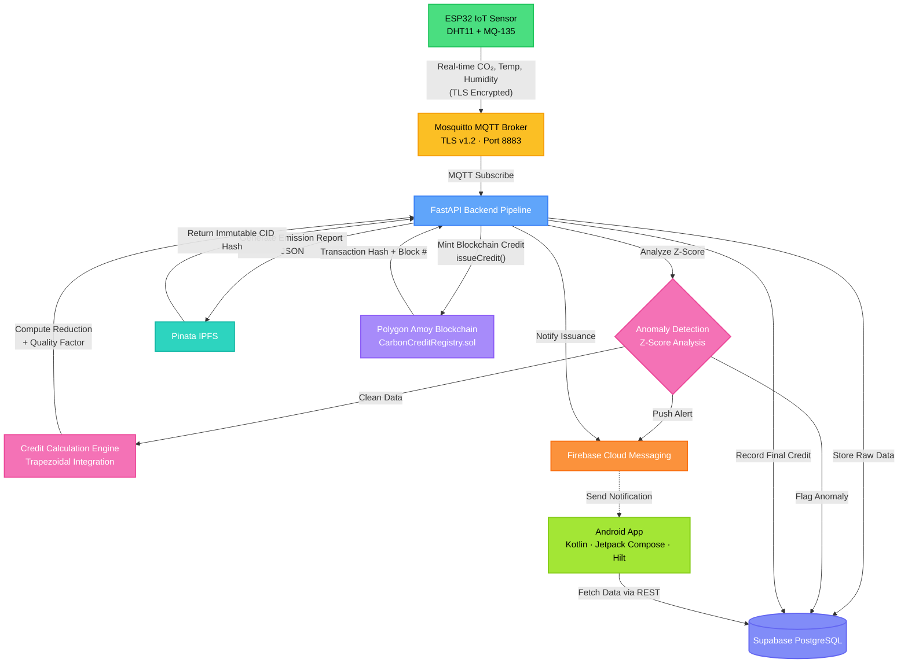
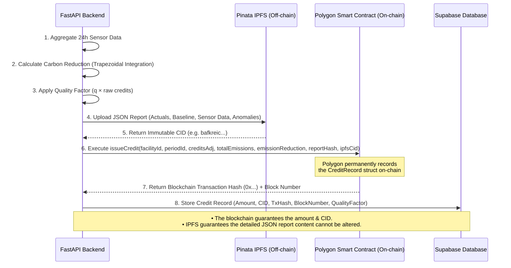

# 🌿 CarbonTrust: Blockchain-based Carbon Credit Verification


**CarbonTrust** is a full-stack, enterprise-grade blockchain platform designed to automate the verification, monitoring, and issuance of carbon credits. The system uses IoT sensors to collect CO₂ emission data, verifies it through statistical anomaly detection, calculates exact emission reductions against baselines, and issues verifiable carbon credits stored on the Polygon blockchain with immutable IPFS audit reports.

---

## ✨ Key Features

- **📡 Real-time IoT Monitoring:** CO₂, temperature, and humidity tracking from ESP32 sensors (DHT11 + MQ-135) via TLS-secured MQTT.
- **🔐 TLS-Secured Communication:** Mosquitto MQTT broker configured with TLS v1.2 and certificate-based encryption for all IoT traffic.
- **🛡️ Anomaly Detection:** Statistical Z-score analysis with configurable thresholds to flag tampered or faulty sensors.
- **🧮 Automated Credit Calculation:** Trapezoidal integration of emission reductions with quality-adjusted scoring for high-precision accounting.
- **⛓️ Blockchain Verification:** Immutable credit records minted securely on the Polygon Amoy testnet via the `CarbonCreditRegistry` smart contract.
- **📄 IPFS Audit Reports:** Tamper-proof JSON emission reports with content-addressed storage (Pinata).
- **🔗 Chain Visualizer:** Interactive blockchain explorer within the app — view the entire credit chain, tap any block to inspect its on-chain data, transaction hash, quality factor, and emission details.
- **📋 On-Chain Contract Record:** Dedicated smart contract detail card displaying all `CreditRecord` struct fields (`facilityId`, `periodId`, `creditsAdj`, `totalEmissions`, `emissionReduction`, `reportHash`, `ipfsCid`, `timestamp`, `blockNumber`) with copyable hashes.
- **📱 Role-Based Mobile App:** Native Android app built with Jetpack Compose featuring dedicated dashboards for Admins, Managers, and Auditors.
- **🏢 Admin & Oversight Tools:** Hierarchical admin dashboard for global oversight of all registered companies, facilities, and real-time auditor assignment management.
- **🔔 Push Notifications:** Firebase Cloud Messaging (FCM) alerts for anomalies and credit issuance.
- **🧪 Built-in Demo Simulator:** Run the entire pipeline dynamically without physical hardware!

---

## 🏗️ System Architecture & Methodology

The methodology follows a robust pipeline: Data Ingestion ➡️ Validation ➡️ Calculation ➡️ Tokenization. 



---

## ⛓️ Blockchain Data Storage Flow

To prevent bloating the blockchain with large amounts of sensor data while still maintaining complete transparency and immutability, CarbonTrust uses a hybrid on-chain/off-chain storage model.



---

## 📜 Smart Contract: CarbonCreditRegistry

The `CarbonCreditRegistry.sol` (Solidity ^0.8.24) deployed on Polygon Amoy stores each carbon credit as a `CreditRecord` struct:

| Field | Type | Description |
|---|---|---|
| `facilityId` | `string` | Facility UUID from Supabase |
| `periodId` | `string` | Human-readable period, e.g. `"2025-05"` |
| `creditsAdj` | `uint256` | Quality-adjusted credits × 1e6 (stored in grams) |
| `totalEmissions` | `uint256` | Total CO₂ emissions × 1e6 (grams) |
| `emissionReduction` | `uint256` | Emission reduction vs baseline × 1e6 (grams) |
| `reportHash` | `bytes32` | SHA-256 of the full emission report JSON |
| `ipfsCid` | `string` | IPFS CID for fetching the full report |
| `timestamp` | `uint256` | `block.timestamp` at issuance |
| `issuedBy` | `address` | Backend wallet address that called `issueCredit()` |

Each credit is assigned a deterministic on-chain ID: `keccak256(facilityId, periodId, reportHash)`.

---

## 📁 Project Structure

```
CarbonTrust-Blockchain/
├── android/                          # Native Android App
│   └── app/src/main/java/com/carboncredit/app/
│       ├── CarbonCreditApp.kt        # Application class (Hilt)
│       ├── core/                     # Utilities (DateUtils, Constants, etc.)
│       ├── data/
│       │   ├── models/               # Data classes (CarbonCredit, Facility, etc.)
│       │   └── repository/           # Supabase repositories
│       ├── di/                       # Hilt dependency injection modules
│       │   ├── AppModule.kt
│       │   ├── NetworkModule.kt
│       │   └── RepositoryModule.kt
│       ├── services/                 # Firebase messaging service
│       └── ui/
│           ├── admin/                # Admin role screens
│           │   ├── dashboard/        # Global oversight dashboard
│           │   └── auditors/         # Auditor assignment management
│           ├── auditor/              # Auditor role screens
│           │   ├── dashboard/        # Auditor dashboard + Chain Explorer banner
│           │   ├── comparison/       # Cross-facility comparison
│           │   ├── facility/         # Facility inspection
│           │   ├── reports/          # Audit report screens
│           │   ├── verification/     # Credit verification workflow
│           │   └── AuditorNavGraph.kt
│           ├── manager/              # Manager role screens
│           │   ├── dashboard/        # Manager dashboard + Chain Explorer banner
│           │   ├── credits/          # Credit ledger, detail, and on-chain card
│           │   ├── analytics/        # Emission analytics charts
│           │   ├── anomalies/        # Anomaly event screens
│           │   ├── sensors/          # Sensor management
│           │   ├── notifications/    # Notification center
│           │   ├── profile/          # User profile
│           │   └── ManagerNavGraph.kt
│           ├── shared/
│           │   └── chain/            # Chain Visualizer (blockchain explorer)
│           ├── auth/                 # Login & registration
│           ├── splash/               # Splash screen
│           ├── components/           # Reusable UI components
│           └── theme/                # Material 3 theme & colors
│
├── backend/                          # Python FastAPI Server
│   ├── app/
│   │   ├── main.py                   # FastAPI app with lifespan (MQTT + Simulators)
│   │   ├── config.py                 # Pydantic settings from .env
│   │   ├── api/
│   │   │   ├── router.py             # Route aggregator (/api/v1)
│   │   │   └── routes/
│   │   │       ├── auth.py           # Authentication endpoints
│   │   │       ├── admin.py          # Admin management endpoints
│   │   │       ├── facilities.py     # Facility CRUD
│   │   │       ├── sensors.py        # Sensor registration & management
│   │   │       ├── readings.py       # Sensor reading queries
│   │   │       ├── credits.py        # Carbon credit endpoints
│   │   │       ├── anomalies.py      # Anomaly event queries
│   │   │       ├── assignments.py    # Auditor ↔ Facility assignments
│   │   │       ├── ipfs.py           # IPFS proxy endpoint
│   │   │       └── simulator.py      # Simulator control API
│   │   ├── core/
│   │   │   ├── mqtt_client.py        # MQTT subscriber (Mosquitto)
│   │   │   ├── supabase_client.py    # Supabase client singleton
│   │   │   └── simulator.py          # Virtual sensor simulator engine
│   │   ├── services/
│   │   │   ├── pipeline.py           # Master pipeline orchestrator
│   │   │   ├── device_auth.py        # Device authentication (bcrypt)
│   │   │   ├── anomaly_detection.py  # Z-score anomaly detection
│   │   │   ├── emission_calculator.py # Trapezoidal integration + quality factor
│   │   │   ├── credit_issuer.py      # IPFS upload + blockchain mint + DB write
│   │   │   ├── report_builder.py     # JSON emission report builder
│   │   │   └── notification_service.py # FCM push notifications
│   │   ├── models/                   # Pydantic schemas
│   │   └── utils/                    # Logging, date utilities
│   ├── requirements.txt
│   ├── .env.example
│   │
│   ├── hardhat/                      # Smart Contract Tooling
│   │   ├── contracts/
│   │   │   └── CarbonCreditRegistry.sol  # Solidity smart contract
│   │   ├── scripts/
│   │   │   └── deploy.js             # Deployment script
│   │   ├── test/                     # Contract tests
│   │   └── hardhat.config.js
│   │
│   └── mosquitto/                    # MQTT Broker Configuration
│       ├── mosquitto.conf            # TLS + auth config (port 8883)
│       └── certs/                    # TLS certificates (gitignored)
│
├── iot/                              # IoT Firmware
│   └── sketch_jun19a.ino            # ESP32 Arduino sketch (DHT11 + MQ-135)
│
├── SETUP_GUIDE.md                    # Full database schema & Supabase SQL
├── WINDOWS_RUN_GUIDE.md              # Windows-specific setup instructions
└── .gitignore
```

---

## 📱 Android App — Role-Based Features

### 👤 Admin
- Global dashboard with oversight of all registered companies and facilities
- Auditor ↔ facility assignment management

### 🏭 Manager
- Real-time dashboard with key emission metrics
- **Chain Explorer** — interactive blockchain visualizer showing the entire credit chain with animated gold-spine UI; tap any block to view full details
- Credit ledger with all issued credits
- Credit detail view with emission summary, IPFS report link, blockchain TX verification, **on-chain smart contract record** (all `CreditRecord` struct fields), and QR code
- Sensor management and live readings
- Anomaly event tracking
- Emission analytics charts
- Push notification center

### 🔍 Auditor
- Auditor dashboard with assigned facilities overview
- **Chain Explorer** — same blockchain visualizer as Manager
- Cross-facility comparison tools
- Facility inspection and verification workflows
- Audit report generation
- Credit detail view with full on-chain data (shared screen with Manager)

---

## 📡 IoT Hardware Layer

The `iot/sketch_jun19a.ino` firmware runs on an **ESP32** microcontroller with the following sensor stack:

| Component | Purpose | Pin |
|---|---|---|
| **DHT11** | Temperature & humidity measurement | GPIO 4 |
| **MQ-135** | CO₂ concentration (ppm) estimation | GPIO 34 (ADC) |

**Communication:** The ESP32 connects to the Mosquitto MQTT broker over **TLS (port 8883)** using `WiFiClientSecure`. Sensor readings are published every 10 seconds as JSON payloads to the topic `factory/{facility_id}/readings`.

**Payload Format:**
```json
{
  "device_id": "SIM_5544F5B2",
  "auth_key": "a109c714-63b0-42e3-88f0-325b7c5083bd",
  "co2_ppm": 850.5,
  "temperature": 34.2,
  "humidity": 60.1,
  "timestamp": "2025-06-19T14:32:00Z"
}
```

---

## 🚀 Comprehensive Setup Guide

This guide covers everything needed to run the full stack locally.

### Prerequisites
- **Python 3.11+**
- **Node.js 18+** (for Hardhat)
- **Android Studio** (Hedgehog or later)
- **Supabase Account** (Free tier)
- **Pinata Account** (Free tier for IPFS)
- **MetaMask Wallet** with Polygon Amoy Testnet MATIC
- **Mosquitto MQTT Broker** (for IoT/simulator communication)
- *(Optional)* **ESP32 + DHT11 + MQ-135** sensors for hardware deployment

### 1. Supabase (Database + Auth) Setup
1. Create a project at [supabase.com](https://supabase.com).
2. Go to **Authentication → Providers** and enable the **Email** provider.
3. Open the **SQL Editor** in Supabase and run the full schema located in `SETUP_GUIDE.md` (which creates `user_profiles`, `facilities`, `sensors`, `sensor_readings`, `carbon_credits`, etc., and sets up Row-Level Security).
4. Go to **Project Settings → API** and copy your `SUPABASE_URL`, `SUPABASE_ANON_KEY`, and `SUPABASE_SERVICE_ROLE_KEY`.

### 2. IPFS (Pinata) Setup
1. Sign up at [pinata.cloud](https://pinata.cloud).
2. Go to **API Keys** → **New Key** (enable `pinFileToIPFS` and `pinJSONToIPFS`).
3. Copy your `PINATA_API_KEY` and `PINATA_SECRET_API_KEY`.

### 3. Blockchain (Polygon Amoy) Setup
1. Add Polygon Amoy to MetaMask (`RPC: https://rpc-amoy.polygon.technology/`, `Chain ID: 80002`).
2. Get free test MATIC from [amoyfaucet.com](https://amoyfaucet.com).
3. Copy your wallet's **Private Key**.
4. Deploy the smart contract:
   ```bash
   cd backend/hardhat
   npm install
   npx hardhat compile
   # Set your DEPLOYER_PRIVATE_KEY in your env before running
   npx hardhat run scripts/deploy.js --network amoy
   ```
5. Copy the deployed `CONTRACT_ADDRESS`.

### 4. Mosquitto MQTT Broker Setup
1. Install Mosquitto from [mosquitto.org](https://mosquitto.org/download/).
2. Generate TLS certificates for secure communication:
   ```bash
   # Generate CA certificate
   openssl req -new -x509 -days 365 -key ca.key -out ca.crt
   # Generate server certificate signed by CA
   openssl req -new -key server.key -out server.csr
   openssl x509 -req -in server.csr -CA ca.crt -CAkey ca.key -CAcreateserial -out server.crt -days 365
   ```
3. Place certificates in `backend/mosquitto/certs/` (this directory is gitignored).
4. Create the password file:
   ```bash
   mosquitto_passwd -c backend/mosquitto/passwd backend_user
   ```
5. Start the broker:
   ```bash
   mosquitto -c backend/mosquitto/mosquitto.conf -v
   ```

### 5. Backend Environment Configuration
Clone the repo and configure the Python backend:

```bash
cd backend
python -m venv venv
source venv/bin/activate       # On Windows: venv\Scripts\activate
pip install -r requirements.txt
cp .env.example .env
```

Edit your `.env` with the following:
```env
APP_ENV=development
SUPABASE_URL=https://<your-project>.supabase.co
SUPABASE_ANON_KEY=<your-anon-key>
SUPABASE_SERVICE_ROLE_KEY=<your-service-role-key>

PINATA_API_KEY=<your-pinata-api-key>
PINATA_SECRET_API_KEY=<your-pinata-secret>
PINATA_GATEWAY=https://gateway.pinata.cloud

POLYGON_RPC_URL=https://rpc-amoy.polygon.technology/
POLYGON_CHAIN_ID=80002
CONTRACT_ADDRESS=<deployed-contract-address>
DEPLOYER_PRIVATE_KEY=<metamask-private-key>

# MQTT Broker Configuration
MQTT_BROKER_HOST=localhost
MQTT_BROKER_PORT=8883
MQTT_USERNAME=backend_user
MQTT_PASSWORD=<your-mqtt-password>

# Enable the simulator to run without real ESP32 hardware!
SIMULATOR_ENABLED=true
SIMULATOR_INTERVAL_SECONDS=10
```

Start the backend server:
```bash
uvicorn app.main:app --host 0.0.0.0 --port 8000 --reload
```

### 6. Android App Setup
1. Open the `android/` folder in Android Studio.
2. Open `android/app/build.gradle.kts` and update the `buildConfigField` strings with your Supabase URL and Anon Key.
3. Add your `google-services.json` from Firebase Console to `android/app/`.
4. Sync Gradle.
5. Run the app on an emulator or physical device.

### 7. IoT Hardware Setup *(Optional)*
1. Open `iot/sketch_jun19a.ino` in Arduino IDE.
2. Install required libraries: `WiFi`, `PubSubClient`, `ArduinoJson`, `DHT`.
3. Update the configuration constants (WiFi SSID, MQTT broker IP, device credentials).
4. Flash to your ESP32 board.
5. Wire sensors: DHT11 → GPIO 4, MQ-135 → GPIO 34.

---

## 🔄 Data Pipeline (Per Sensor Reading)

```
1. ESP32/Simulator publishes reading → Mosquitto MQTT (TLS)
2. Backend MQTT subscriber receives payload
3. Validate payload fields
4. Authenticate device (device_id + bcrypt auth_key)
5. Store raw reading in Supabase
6. Run anomaly detection (moving-average + Z-score)
   ├── If anomaly → flag reading, insert anomaly_event, notify via FCM, STOP
   └── If clean → continue
7. Check credit calculation window (configurable hours since last credit)
8. Calculate credits via trapezoidal integration
9. Apply quality factor (q × raw credits = adjusted credits)
10. Build emission report JSON → upload to IPFS (Pinata)
11. Call issueCredit() on Polygon smart contract
12. Store final credit record in Supabase
13. Send FCM notification (credit issued)
```

---

## 💻 Tech Stack

| Domain | Technology |
|---|---|
| **Backend API** | FastAPI (Python 3.11+) |
| **Database** | Supabase (PostgreSQL + Row-Level Security) |
| **Smart Contracts** | Solidity ^0.8.24, Hardhat |
| **Blockchain** | Polygon Amoy Testnet |
| **Decentralized Storage** | Pinata (IPFS) |
| **Mobile Application** | Android (Kotlin, Jetpack Compose, Material 3, Hilt) |
| **IoT Hardware** | ESP32 + DHT11 + MQ-135 |
| **IoT Protocol** | MQTT over TLS v1.2 (Mosquitto, port 8883) |
| **Push Notifications** | Firebase Cloud Messaging (FCM) |
| **QR Verification** | ZXing (on-device QR generation for blockchain TX links) |

---

## 📜 License
This project is licensed under the MIT License. See the LICENSE file for details.
