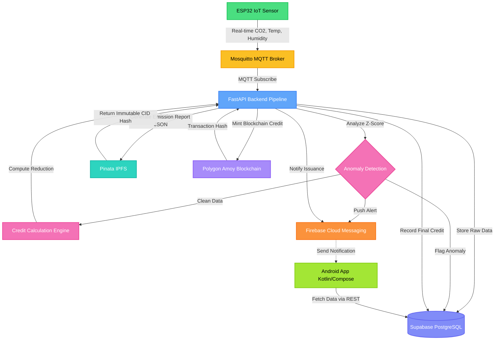
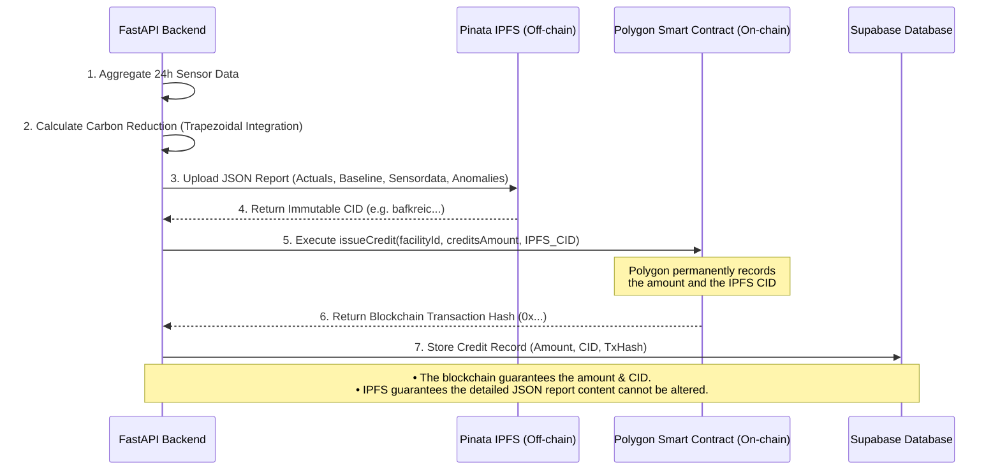

# 🌿 CarbonTrust: Blockchain-based Carbon Credit Verification


**CarbonTrust** is a full-stack, enterprise-grade blockchain platform designed to automate the verification, monitoring, and issuance of carbon credits. The system uses IoT sensors to collect CO₂ emission data, verifies it through statistical anomaly detection, calculates exact emission reductions against baselines, and issues verifiable carbon credits stored on the Polygon blockchain with immutable IPFS audit reports.

---

## ✨ Key Features

- **📡 Real-time IoT Monitoring:** CO₂, temperature, and humidity tracking from ESP32 sensors via MQTT.
- **🛡️ Anomaly Detection:** Statistical Z-score analysis with configurable thresholds to flag tampered or faulty sensors.
- **🧮 Automated Credit Calculation:** Trapezoidal integration of emission reductions over time for high-precision accounting.
- **⛓️ Blockchain Verification:** Immutable credit records minted securely on the Polygon Amoy testnet.
- **📄 IPFS Audit Reports:** Tamper-proof JSON emission reports with content-addressed storage (Pinata).
- **📱 Auditor & Manager Dashboards:** Native Android app built with Jetpack Compose featuring role-based access.
- **🔔 Push Notifications:** Firebase Cloud Messaging (FCM) alerts for anomalies and credit issuance.
- **🧪 Built-in Demo Simulator:** Run the entire pipeline dynamically without physical hardware!

---

## 🏗️ System Architecture & Methodology

The methodology follows a robust pipeline: Data Ingestion ➡️ Validation ➡️ Calculation ➡️ Tokenization. 



---

## ⛓️ Blockchain Data Storage Flow

To prevent bloating the blockchain with large amounts of sensor data while still maintaining complete transparency and immutability, CarbonTrust uses a hybrid on-chain/off-chain storage model.



---

## 🚀 Comprehensive Setup Guide

This guide covers everything needed to run the full stack locally.

### Prerequisites
- **Python 3.11+**
- **Node.js 18+** (for Hardhat)
- **Android Studio**
- **Supabase Account** (Free tier)
- **Pinata Account** (Free tier for IPFS)
- **MetaMask Wallet** with Polygon Amoy Testnet MATIC

### 1. Supabase (Database + Auth) Setup
1. Create a project at [supabase.com](https://supabase.com).
2. Go to **Authentication → Providers** and enable the **Email** provider.
3. Open the **SQL Editor** in Supabase and run the full schema located in `SETUP_GUIDE.md` (which creates `user_profiles`, `facilities`, `sensors`, `sensor_readings`, `carbon_credits`, etc., and sets up Row-Level Security).
4. Go to **Project Settings → API** and copy your `SUPABASE_URL`, `SUPABASE_ANON_KEY`, and `SUPABASE_SERVICE_ROLE_KEY`.

### 2. IPFS (Pinata) Setup
1. Sign up at [pinata.cloud](https://pinata.cloud).
2. Go to **API Keys** → **New Key** (enable `pinFileToIPFS` and `pinJSONToIPFS`).
3. Copy your `PINATA_API_KEY` and `PINATA_SECRET_API_KEY`.

### 3. Blockchain (Polygon Amoy) Setup
1. Add Polygon Amoy to MetaMask (`RPC: https://rpc-amoy.polygon.technology/`, `Chain ID: 80002`).
2. Get free test MATIC from [amoyfaucet.com](https://amoyfaucet.com).
3. Copy your wallet's **Private Key**.
4. Deploy the smart contract:
   ```bash
   cd backend/hardhat
   npm install
   npx hardhat compile
   # Set your DEPLOYER_PRIVATE_KEY in your env before running
   npx hardhat run scripts/deploy.js --network amoy
   ```
5. Copy the deployed `CONTRACT_ADDRESS`.

### 4. Backend Environment Configuration
Clone the repo and configure the Python backend:

```bash
cd backend
python -m venv venv
source venv/bin/activate
pip install -r requirements.txt
cp .env.example .env
```

Edit your `.env` with the following:
```env
APP_ENV=development
SUPABASE_URL=https://<your-project>.supabase.co
SUPABASE_ANON_KEY=<your-anon-key>
SUPABASE_SERVICE_ROLE_KEY=<your-service-role-key>

PINATA_API_KEY=<your-pinata-api-key>
PINATA_SECRET_API_KEY=<your-pinata-secret>
PINATA_GATEWAY=https://gateway.pinata.cloud

POLYGON_RPC_URL=https://rpc-amoy.polygon.technology/
POLYGON_CHAIN_ID=80002
CONTRACT_ADDRESS=<deployed-contract-address>
DEPLOYER_PRIVATE_KEY=<metamask-private-key>

# Enable the simulator to run without real ESP32 hardware!
SIMULATOR_ENABLED=true
SIMULATOR_DEVICE_ID=DEMO_SENSOR_001
SIMULATOR_AUTH_KEY=demo-auth-key-12345
SIMULATOR_INTERVAL_SECONDS=10
```

Start the backend server:
```bash
uvicorn app.main:app --host 0.0.0.0 --port 8000 --reload
```

### 5. Android App Setup
1. Open the `android/` folder in Android Studio.
2. Open `android/app/build.gradle.kts` and update the `buildConfigField` strings with your Supabase URL and Anon Key.
3. Sync Gradle.
4. Run the app on an emulator or physical device.

---

## 💻 Tech Stack

| Domain | Technology |
|---|---|
| **Backend API** | FastAPI (Python 3.11+) |
| **Database** | Supabase (PostgreSQL) |
| **Smart Contracts** | Solidity, Hardhat |
| **Blockchain** | Polygon Amoy Testnet |
| **Decentralized Storage** | Pinata (IPFS) |
| **Mobile Application** | Android (Kotlin, Jetpack Compose, Hilt) |
| **IoT Protocol** | MQTT (Mosquitto) |
| **Push Notifications** | Firebase Cloud Messaging (FCM) |

---

## 📜 License
This project is licensed under the MIT License. See the LICENSE file for details.
